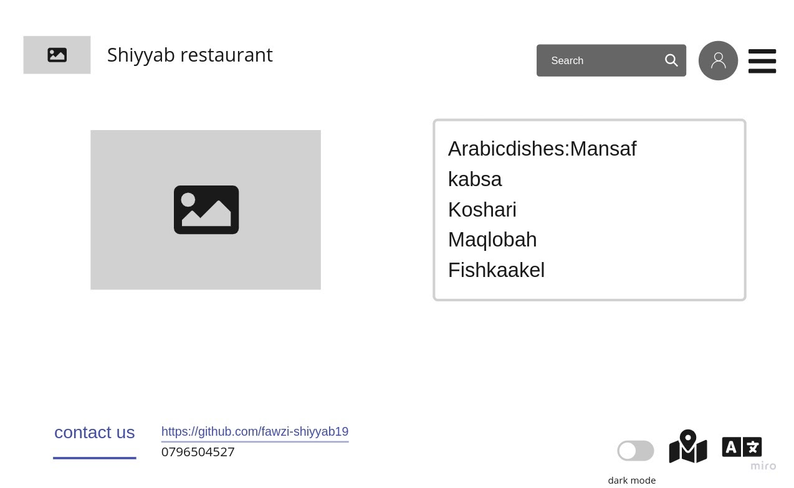

# my-restaurant

# Shiyyab Resturant

## Type od dishes :
1. Arabic dishes
2. Indian dishes
3. Italian dishes
4. Mexican dishes
5. Chinese dishes

## Menu :
#### Arabic dishes:
- Mansaf
- kabsa 
- Koshari
- Maqlobah
- Fish
- kaakel
 

#### Indain dishes:
- Aloo gobi
- Crisp papadum
- Chicken tikka masala
 

#### Italian dishes:
- Pizza
- Creamy Garlic Salmon
- Tomato Basil Soup
- Pasta bake with sausage
 

#### Mexican dishes:
- Chilaquiles
- Huevos Rancheros
- Machaca 
- Tacos
 

#### Chinese dishes:
- Hot and Sour Soup
- Nodels
- Chicken with Chestnuts
- Spring Rolls
 

---
